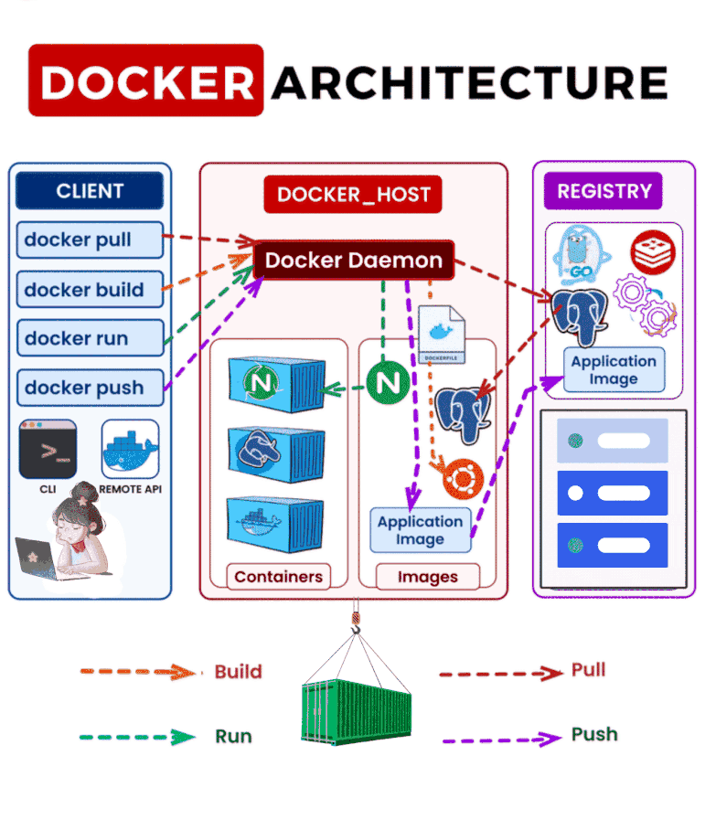

1. **What is Docker?**  
   - **Docker** is a containerization platform that enables you to create, deploy, and run applications in lightweight, portable containers.  
   - **Containerization** is a method of virtualizing an operating system (OS) to run applications in isolated environments, called containers. Docker implements containerization.  
   - Docker is commonly used to create an application’s environment and dependencies into a single container, making it easier to run the application across different platforms.

2. ### **Docker Lifecycle and Components**

---

#### **Docker Lifecycle**  
The Docker lifecycle refers to the process of creating, running, managing, and retiring containerized applications. It consists of the following stages:  
1. **Build**: Create Docker images using a **Dockerfile**, which defines the application and its dependencies.  
2. **Distribute**: Store and share Docker images through a **Docker Registry** like Docker Hub or a private registry.  
3. **Run**: Launch containers from Docker images using the Docker Engine and manage them using commands or orchestration tools.  
4. **Manage**: Monitor, update, and scale containers using Docker tools or third-party solutions.  
5. **Retire**: Remove unused containers, images, and other resources to free up system resources.

---

#### **Core Components of Docker**  

1. **Docker Daemon (`dockerd`)**  
   - **Definition**: The brain of Docker, running as a background process on the host system.  
   - **Role**:  
     - Manages core Docker objects: containers, images, volumes, and networks.  
     - Listens to Docker API requests and performs actions like building, running, and stopping containers.  
     - Ensures efficient resource allocation and execution of tasks.  

2. **Docker Engine**  
   - **Definition**: The core framework that powers Docker, combining tools and services for managing containers.  
   - **Role**:  
     - Includes the **Docker Daemon**, **Docker CLI**, and **Docker REST API**.  
     - Manages container lifecycle operations (build, start, stop, and remove).  
     - Acts as the backbone of Docker operations; if it fails, all containers stop.

3. **Docker CLI (Command-Line Interface)**  
   - **Definition**: The interface for users to interact with Docker through commands.  
   - **Role**:  
     - Provides commands for managing containers, images, volumes, and networks.  
     - Common commands: `docker build`, `docker run`, `docker ps`, `docker stop`, etc.  
     - Simplifies communication with the Docker Daemon.

4. **Docker Registry**  
   - **Definition**: A repository for storing and distributing Docker images.  
   - **Role**:  
     - Public registry: **Docker Hub**, offering prebuilt images for various applications.  
     - Private registry: Custom setups for secure, internal image sharing.  
     - Enables pulling images for container creation and pushing custom-built images.

5. **Dockerfile**  
   - **Definition**: A plain text file containing instructions for building Docker images.  
   - **Role**:  
     - Automates the creation of Docker images.  
     - Specifies dependencies, configurations, and environment setup for applications.  
     - Includes steps like `FROM` (base image), `RUN` (commands to execute), and `CMD` (default command).  

6. **Docker Images**  
   - **Definition**: Read-only templates that include application code, dependencies, and configurations.  
   - **Role**:  
     - Serve as blueprints for creating containers.  
     - Portable across environments, ensuring consistency.  
     - Built from Dockerfiles or pulled from a Docker Registry.

7. **Docker Containers**  
   - **Definition**: The runtime instances of Docker images.  
   - **Role**:  
     - Provide isolated environments for running applications.  
     - Lightweight, portable, and efficient.  
     - Share the host OS kernel but remain isolated from the host and other containers.

8. **Docker Volumes**  
   - **Definition**: Persistent storage solutions for containers.  
   - **Role**:  
     - Store data independently of container lifecycle.  
     - Facilitate data sharing between containers.  
     - Ensure data persistence even after container deletion.

9. **Docker Network**  
   - **Definition**: The system that allows communication between Docker containers and external networks.  
   - **Role**:  
     - Provides networking modes (e.g., bridge, host, overlay).  
     - Ensures secure, efficient container communication.  
     - Enables service discovery in multi-container setups.

10. **Orchestration Tools (Optional)**  
    - Tools like **Kubernetes** or **Docker Swarm** for managing container clusters at scale.  
    - Automate deployment, scaling, and monitoring of containers.

---


  
3. **Docker Workflow** (Lifecycle):  
   - **Step 1: Create a Dockerfile**:  
     A **Dockerfile** is written to define the steps for building an image. Here’s an example of a simple Dockerfile to run a basic Python application:

     ```dockerfile
     # Use an official Python runtime as a parent image
     FROM python:3.8-slim

     # Set the working directory in the container
     WORKDIR /app

     # Copy the current directory contents into the container at /app
     COPY . /app

     # Install any needed packages specified in requirements.txt
     RUN pip install --no-cache-dir -r requirements.txt

     # Make port 5000 available to the world outside the container
     EXPOSE 5000

     # Define environment variable
     ENV NAME World

     # Run app.py when the container launches
     CMD ["python", "app.py"]
     ```

   - **Step 2: Build the Docker Image**:  
     Once the Dockerfile is ready, the next step is to build the image. This is done using the command:

     ```bash
     docker build -t <image-name>:<tag> .
     ```

     - This command tells Docker to read the Dockerfile in the current directory (`.`), build the image, and tag it as `<image-name>:<tag>` (e.g., `my-python-app:latest`).

   - **Step 3: Run the Docker Container**:  
     After building the image, you can create and run a container from that image using:

     ```bash
     docker run -d -p 5000:5000 <image-name>:<tag>
     ```

     - This will run the container in detached mode (`-d`) and map port 5000 from the container to port 5000 on the host system (`-p 5000:5000`).

   - **Step 4: Execute Commands Inside the Container**:  
     If you need to execute commands inside the running container, you can use:

     ```bash
     docker exec -it <container-id> /bin/bash
     ```

     This opens an interactive shell inside the container.

4. **Managing Docker**:  
   - **Check Docker Status**:  
     To verify if Docker is running on your system, use the following command:

     ```bash
     sudo systemctl status docker
     ```

   - **Add a User to Docker Group**:  
     By default, Docker runs as the root user. To allow a non-root user to run Docker commands, add the user to the `docker` group:

     ```bash
     sudo usermod -aG docker <username>
     ```

     After running this command, log out and log back in for the changes to take effect.

5. **Important Concepts to Understand**:  
   - **Docker is dependent on Docker Engine**, and if the Docker Engine goes down, all containers running will be affected. To avoid this, tools like **Docker Swarm** or **Kubernetes** are used for clustering and high availability.
   - **Docker Images** are immutable and contain everything needed to run the application, including the application code, libraries, system dependencies, and runtime environment.
   - **Containers** are lightweight, isolated environments that run applications. Containers share the host OS kernel but remain isolated from each other.
  
6. **Why Docker?**  
   Docker provides a consistent environment for development, testing, and production. By containerizing applications, it becomes easier to deploy and scale them across different environments, which leads to faster development and more reliable deployments.

### Summary:
- **Docker** simplifies application deployment using containers that package code and dependencies into lightweight, portable units.
- **Docker Daemon** is the brain of Docker, managing containers and responding to requests via the Docker API.
- **Docker Registry** stores images, which are used to create containers.
- **Dockerfile** defines how to build a Docker image.
- Containers are lightweight and share the host OS, while virtual machines have their own full OS, making containers more efficient.
- Docker Engine is critical, and if it fails, containers will stop. To ensure high availability, additional tools like Docker Swarm or Kubernetes are used.